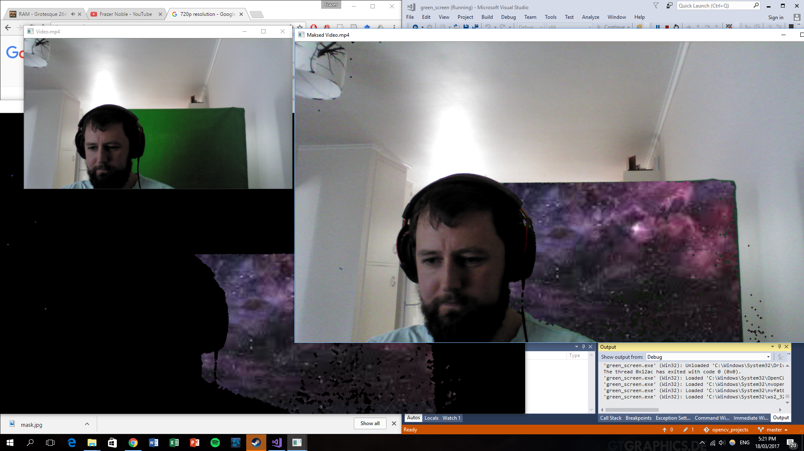

# green_screen

# Description

Demonstrates how the Open Computer Vision (OpenCV) library can be used to detect the colour green and replace it with a desired background. The command line can be used to modify the program's behavior. Works for either an image (.jpg, .png), a video (.mp4, .avi) input, or video capture device (i.e. a USB webcam).

# Table of Contents

1. Requirements.
1. Installation.
1. Usage.
1. Contribution.
1. Credits.

# Requirements

1. [gflags](https://github.com/gflags/gflags).
1. [CMake](https://cmake.org/).
1. [OpenCV 3.20](http://opencv.org/).
1. [Microsoft Visual Studio 2017](https://www.visualstudio.com/).
1. A USB web camera, video file (.mp4, .avi), or image (.jpg, .png).

To help ensure everything works, I'd also suggest you create the following enrionmental variables:
1. OPENCV_DIR C:/opencv/opencv/build. Note, this is the directory wherever you installed OpenCV.
1. DEV_LIBRARIES C:/dev_libraries. Note, this is the directory wherever you have/will put the built gflags repo.

# Installation

The following instructions are relevant for x64 machines:

1. Clone the opencv_projects repo'.
1. Clone the gflags repo'.
1. If you've not dones soo already, build gFlags using CMake as an Administrator. Also, ensure 'Shared Libraries' are enabled. Once completed, by default, you should find that there is now a C:/Program Files/gFlags directory, which contains an Include and Lib sub-directory. Move this directory to C:/dev_libraries/.
1. Open the green_screen.sln file.
1. Change the solution platforms from x86 to x64, if necessary.
1. Build the project.

At this point everything should compile and run. You should have three windows appear, as depicted below.

# Usage

Assuming you have a USB web camera, when you run the executable it'll extract and image and look for the colour green; where it finds the colour green, it'll replace it with the background.

Here's a screen shot of the expected outputs:

If you call green_screen.exe from the command line, you can use the following flags:  
-i to set the input directory.  
-f to set the file name.  
-o to set the output directory.  
-d to set the debug flag.  

# Contributing

If you feel like you can make a contribution; please, feel free to make a request.

# Credits

Dr. Frazer K. Noble 2017
